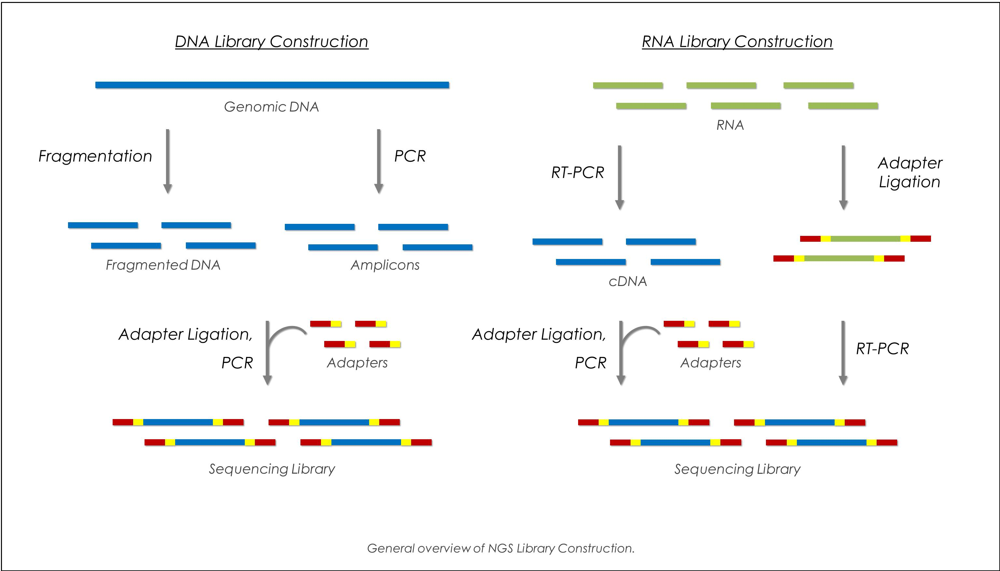
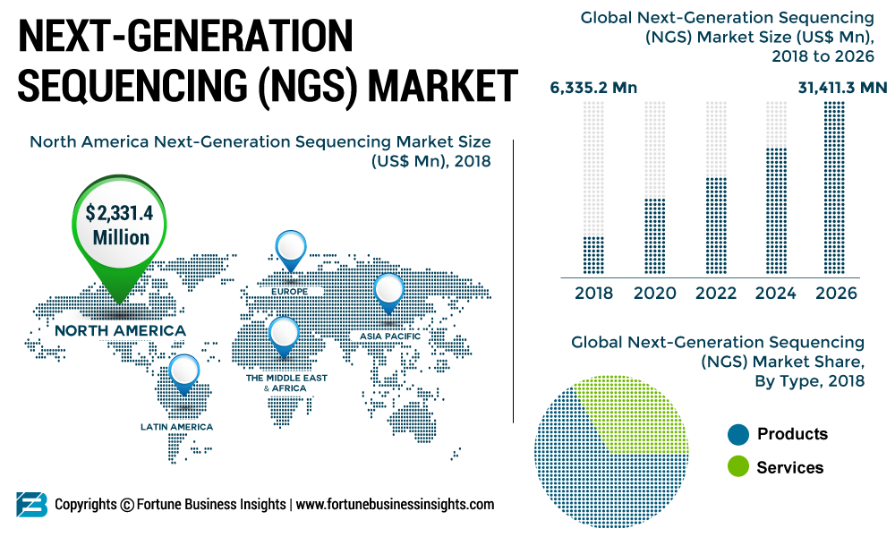
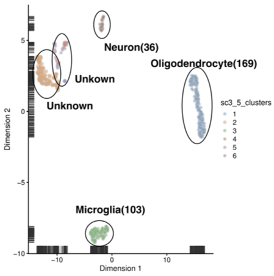
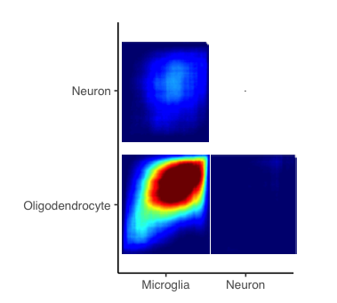
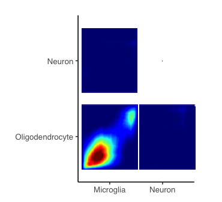
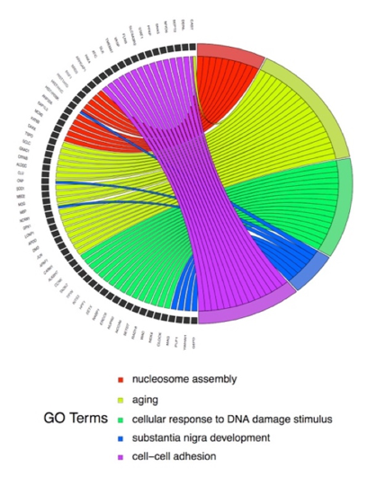

```{r,include=F}
require(rgdal)
require(tidyverse)
knitr::opts_chunk$set(
  fig.width = 6,
  fig.asp = .6,
  out.width = "80%"
)

library("htmltools")
library("vembedr")

```


### Why am I doing this? 

Next-generation sequencing (NGS) technologies have provided inspiring results of complex biological systems. Single cell RNA analysis, focusing on the characterization of individual cells, could allow researchers to explore potentially new and unpredicted effects of various factors on subjects.

Single cell RNA sequencing was performed in cells from Rat that treated with cocaine or saline self-administration and then followed with cocaine or saline challenge. The goal of this project is to quantify cocaine-induced cell-type specific gene expression changes.



### What Have I done?

#####Quality Control

Quality control was first performed to avoid technical noise, which may obscure the biological information of downstream analysis.

* Remove cells that had a total counts of RNA molecules smaller than 2000, a total number of unique genes smaller than 1000, and with percent of mitochondria genes larger than 15%.

* Remove mitochondrial genes and genes that shared ribosomal protein name according the RGD Genome database

#####Clustering

The after-QC cells were then clustered based on the SC3 algorithm. Silhouette Index were calculated by SC3 algorithm with a number of cluster K ranging from four to nine. Five clusters were determined with a largest Silhouette Index. 

#####Differential Analysis

Then the hurdle model was applied to each cell type to quantify the significant change of stimulation, treatment and interaction, shown in the following equation. 


$$
log(exp counts) = cngeneson+stimulation+treatment+treatment*stimulation
$$


#####Visualization Tools


Rank–rank hypergeometric overlap graphical maps(RRHO) and Gene Ontology terms plots were used to visualize the results. 

### What have I found? 


####Cell Type Determination

The SC3 algorithm were performed. A total number of five clusters were determined with a silhouette index of 0.68. The clusters were then overlapped with the Top 50 Cell Type-Specific Genes provided by Gokce. However, from the UMAP map, the fourth cluster showed similarities with the second unknown cluster. Furthermore, the fifth cluster showed discernibly two parts. Therefore, the fifth cluster were then further divided into two clusters, one is identified as Neuron and the other one was identified as unknown. Three cell types can be then identified as Microglia, Oligodendrocyte, and Neuron. 



**Figure 1**: The UMAP map of the six clusters determined by SC3, including Microglia, Neurons, Oligodendrocyte and unknown clusters. The number of cells for each cell type were also shown.

####RRHO

The rank-rank overlap analysis showed that there was strong correlation at the down - down regulated differential genes between oligodendrocyte and microglia for the stimulation and treatment term. Furthermore, for the interaction term there exist a strong consistency at the up – up regulated differential genes. There is no significant consistency showing between oligodendrocyte and microglia with neuron.  



**Figure 2**: The RRHO plot of interaction(1), stimulation(2), treatment(3) between Microglia, Neuron, and Oligodendrocyte pair wisely


####Gene Ontology

For Microglia, the top five gene ontology terms include: mRNA processing, regulation of proteasomal protein catabolic process, mRNA polyadenylation, RNA splicing and positive regulation. For Neuron, cerebral cortex development, hippocampus development, positive regulation of synapse assembly, RNA processing and positive regulation of proteasomal protein catabolic process. For Oligodendrocyte, GO enrichment analysis showed that nucleosome assembly, aging, cellular response to DNA damage stimulus, substantia nigra development and cell–cell adhesion are the top five significant terms.  



**Figure 3**: The top five significant GO terms of interaction term for Microglia(1), Neuron(2) and Oligodendrocyte(3). 

