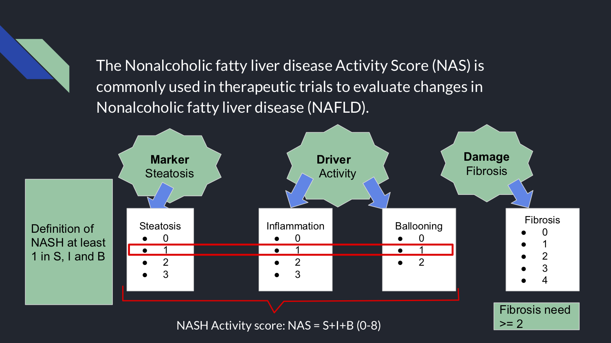

```{r setup, include=FALSE}
knitr::opts_chunk$set(echo = TRUE)
library(tidyverse)
library(ggpubr)
library(rstatix)
library(psych)
```

######Please note that because this is a new project that has not been published yet. The real data and results are not showed here. Pseudo data is used instead to show the analysis progress.

####Background

Nonalcoholic fatty liver disease(NAFLD) is characterized by hepatic steatosis in the absence of a history of significant alcohol use  or other known liver disease.  Nonalcoholic steatohepatitis (NASH) is the progressive form of NAFLD. 





###Research Question

To investigate the interobserver reproducibility of the NAS score, and the variation between final diagnosis and NAS score, among subspecialist liver-GI pathologists at a single academic medical center.

###Methods

####Data Load(Generate) and Wrangling

```{r}
id <- seq(1, 40, by=1)

steatosis1 <- sample.int(3, 40, replace = TRUE)
steatosis2 <- sample.int(3, 40, replace = TRUE)
steatosis3 <- sample.int(3, 40, replace = TRUE)
steatosis4 <- sample.int(3, 40, replace = TRUE)

Inflammation1 <- sample.int(3, 40, replace = TRUE)
Inflammation2 <- sample.int(3, 40, replace = TRUE)
Inflammation3 <- sample.int(3, 40, replace = TRUE)
Inflammation4 <- sample.int(3, 40, replace = TRUE)

Bollooning1 <- sample.int(2, 40, replace = TRUE)
Bollooning2 <- sample.int(2, 40, replace = TRUE)
Bollooning3 <- sample.int(2, 40, replace = TRUE)
Bollooning4 <- sample.int(2, 40, replace = TRUE)

mydata <- cbind(id, steatosis1, steatosis2, steatosis3, steatosis4, Inflammation1, Inflammation2, Inflammation3, Inflammation4, Bollooning1, Bollooning2, Bollooning3, Bollooning4) %>% 
  as.data.frame() %>% 
  janitor::clean_names() %>% 
  mutate(nas1 = steatosis1 + inflammation1 + bollooning1,
         nas2 = steatosis2 + inflammation2 + bollooning2,
         nas3 = steatosis3 + inflammation3 + bollooning3,
         nas4 = steatosis4 + inflammation4 + bollooning4)

mydata_long <- mydata %>% 
  gather(key = "doctor", value = "nas_score", nas1, nas2, nas3, nas4) %>% 
  convert_as_factor(id, doctor) %>% 
  select(id, doctor, nas_score) %>% 
  distinct() %>% 
  mutate(doctor = as.factor(str_replace(doctor, "nas", "doctor")))

```

####Check Assumption
```{r}
mydata_long %>%
  group_by(doctor) %>%
  identify_outliers(nas_score)

mydata_long %>%
  group_by(doctor) %>%
  shapiro_test(nas_score)
```

####Test
```{r}
res.aov <- anova_test(data = mydata_long, dv = nas_score, wid = id, within = doctor)
get_anova_table(res.aov)
### pairwise comparisons
pwc <- mydata_long %>%
  pairwise_t_test(
    nas_score ~ doctor, paired = TRUE,
    p.adjust.method = "bonferroni"
    )
pwc
```

###Visualization
```{r}
pwc <- pwc %>% add_xy_position(x = "doctor")

bxp <- ggboxplot(mydata_long , x = "doctor", y = "nas_score", add = "point")
bxp+
  labs(
    subtitle = get_test_label(res.aov, detailed = TRUE),
    caption = get_pwc_label(pwc)
  )
```


