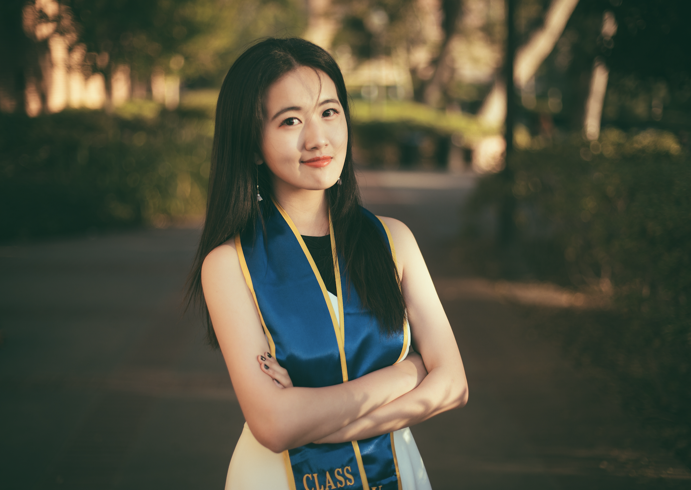

### About me
I graduated from UCLA, major in Chemical Engineering, Biomolecular Option. 

I worked in Biotechnology lab for more than two years, focusing on free carbon fixation and enzyme assay researches.

I am a second year Biostatistics graduate student at Columbia University, Mailman School of Public Health. 

I am a qualified statistical programmer candidate with extensive understanding of machine learning, data mining, clinical trials analysis, and big data analytics and related workflow.

I've completed numbers of academic projects related to clinical trails, including [the study the incident rate of TB among Type II diabetes patients](Resume.html), [NAS score accuracy](Resume.html) and [gene expression changes among brain cells of mice](Resume.html). 

###Resume
[Here](Resume.html) is my professional resume. 

